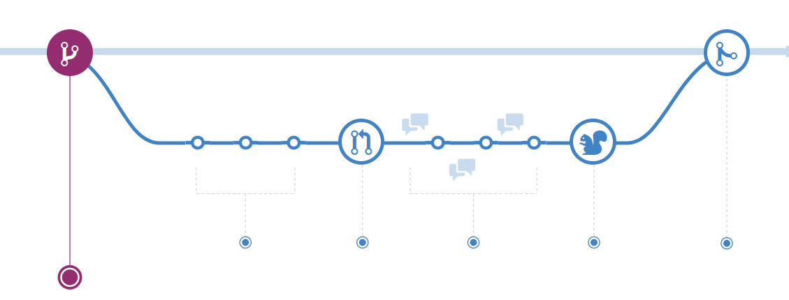
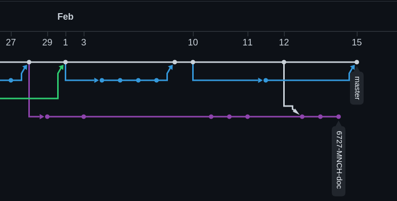

# Intro Github and branching 

A introductory guide to the concepts behind Github 

[mrjones @ github](https://github.com/mrjones-plip)

[presentation source @ github](https://github.com/mrjones-plip/mrjones-medic-scratch/tree/main/github-howto)

---

## Github vs git

* Github: web interface to git (+ special sauce)
* git: created to track revisions in software, works on text, images etc

---

## clone

* copies a repository remote server -> your computer 
* get a *complete* copy of *every* change, *ever*
* normally happen  github -> your computer
* changes made on your computer (aka in your clone) only exist locally until you `commit` and `push` them

---

## commit

* changes are recorded to your clone when you `commit` them
* changes are shared with others when you `push` your commits to the parent repository where you cloned from
* any changes you make can be reverted at any time
* any changes you do not `push` can not be seen by others

---

## branch

* branches normally capture a logical chunk of work (ie a ticket)
* branches normally have a ticket in their name: `6724-MNCH-docs`
* all branches exist locally, both `master` and any new ones like `6724-MNCH-docs`
* allows others to view your work (and even add commits!)

---

## pull request

* explicitly created to get feedback on a request to merge changes to `master`
* allow you to view and comment on a series of commits. 
* not part of git, provided by Github
* other users can comment and request changes in a PR
* multiple commits may be added over time to address feedback

---

## life of a branch

* [see github docs](https://guides.github.com/introduction/flow/)

---

## MNCH Docs branch

* [see MNCH network graph](https://github.com/medic/cht-docs/network)

---

## Thanks!

* By: [mrjones](https://github.com/mrjones-plip)
* Source: [app-building repo](https://github.com/mrjones-plip/mrjones-medic-scratch/tree/main/github-howto)
* Made: [reveal-md](https://github.com/webpro/reveal-md)

